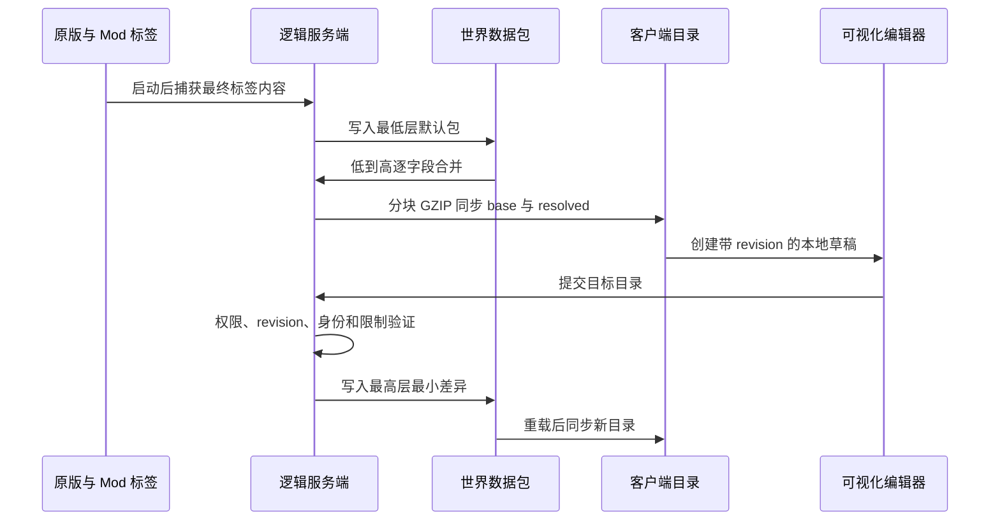

# 架构设计

## 设计目标

- 不解冻或替换 Minecraft 已冻结的创造标签注册表。
- 保留原版及已注册 Mod 标签对象身份。
- 让标题、图标、可见性、顺序、布局和内容可以随数据包重载。
- 允许数据包新增只存在于运行时目录中的分类标签。
- 让服务端成为最终数据和保存权限的唯一权威。

## 数据流

## 注册标签与运行时标签

已注册标签继续使用原对象。Mixin 只把可数据驱动的方法结果和内容构建投影到当前不可变目录。

纯 JSON 新标签不会写入冻结注册表，而是由运行时目录创建对象，再交给加载器专用分页适配器显示。因此：

- 常规依赖已有标签对象的兼容性较好。
- 直接枚举内建注册表的代码不会看到 JSON-only 标签。
- 修改相同创造界面输入、缓存或坐标方法的 Mod 仍可能冲突。

## 服务端

1. 启动完成后，在绕过本 Mod 投影的状态下重建原生标签内容。
2. 捕获 Fabric/Forge 事件及其他 Mod 最终贡献。
3. 以逐文件原子替换方式写入最低优先级默认包，并清理过期 JSON。
4. 按真实包栈解析字段补丁，得到 `base` 和 `resolved`。
5. 验证并同步给客户端。
6. 编辑保存时写入最高优先级最小差异包并执行资源重载。

## 客户端

- 客户端接收不可变目录和服务端修订号。
- 编辑期间创建深复制草稿。
- 预览状态限制在渲染线程，不泄漏到单人游戏的逻辑服务端线程。
- 保存等待服务端确认；取消直接丢弃预览。
- Fabric 和 Forge 分别维护加载器侧分页状态，公共编辑器通过薄平台接口切换页面。

## 网络边界

两个方向都使用 GZIP 和分块传输：

| 项目 | 上限 |
| --- | --- |
| 单块 | `24 KiB` |
| 分块数量 | `171` |
| 单个逻辑负载压缩后 | `4 MiB` |
| 解压后 | `16 MiB` |

分块数量达到 `171` 时，所有块合计仍必须小于或等于 `4 MiB`。资源重载阶段会预先检查 `base + resolved` 快照是否能通过这些限制。

公共网络模型使用 `FriendlyByteBuf` 编解码，并为每种 payload 暴露固定频道
ID。Fabric 通过 Fabric Networking API 注册频道，Forge 通过
`SimpleChannel` 注册消息；方向校验和游戏线程调度由各加载器模块负责。

## Java 访问策略

纯访问性需求优先使用加载器原生转换：

- Fabric：`visual_creative_tab_editor.accesswidener`，使用 `named` 映射名。
- common：`META-INF/accesstransformer.cfg` 使用 SRG 名称，由 legacy ModDev 在源码重映射前应用。
- Forge：`forge/src/main/resources/META-INF/accesstransformer.cfg` 同样使用运行时要求的 SRG 名称。
- 项目不使用 Mixin `@Accessor` 或 `@Invoker`。

保留的 Mixin 只用于必须改变行为的位置，例如数据驱动返回值、输入拦截、创造内容缓存重建和虚拟末尾槽位计算。

多加载器共享 Gradle 约定位于 `buildSrc/`；仓库模块固定为
`common`、`fabric` 和 `forge`。
